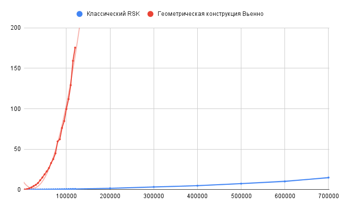
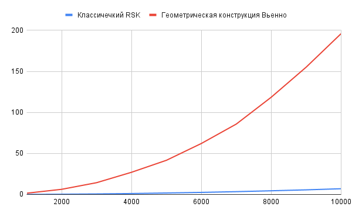

# Алгоритм RSK

Классический алгоритм Робинсона-Шенстеда-Кнута (RSK) — это метод, используемый для построения пары таблиц Юнга (таблиц Юнга) из перестановки или последовательности чисел. Он имеет важное значение в комбинаторике и теории представлений.

*тут картинка исходной перестановки и результата*

## Применение алгоритма RSK

### Комбинаторика:
Алгоритм RSK используется для изучения структуры перестановок и их свойств. Он позволяет связать перестановки с таблицами Юнга, что является важным инструментом в комбинаторной теории. Также алгоритм играет ключевую роль в алгебраической комбинаторике, где он используется для изучения симметрических функций, таких как функции Шура. Алгоритм RSK также используется для изучения цепей и антицепей в перестановках. Цепь в перестановке — это последовательность элементов, каждый из которых меньше следующего. Антицепь — это последовательность элементов, каждый из которых больше следующего. Алгоритм RSK помогает определить длину наибольшей цепи и антицепи в перестановке, что важно для изучения свойств перестановок и их структуры.

## Основные шаги алгоритма классического RSK
### Инициализация:

Создаются две пустые таблицы: таблица P (таблица вставки) и таблица Q (таблица записи).
Первый элемент перестановки добавляется в первую строку таблицы P, а в таблицу Q добавляется индекс этого элемента — для первого элемента это 1.
### Основной цикл:

Для каждого элемента перестановки, начиная со второго, выполняется процесс вставки в таблицу P и обновления таблицы Q.
### Вставка элемента в таблицу P:

Элемент *a* вставляется в первую строку таблицы P, согласно следующим правилам:
1. Если *a* больше последнего элемента в строке, он добавляется в конец строки.
2. Если *a* меньше или равен последнему элементу, ищется первый элемент в строке, который больше *a*. Этот элемент выталкивается и заменяется на *a*. Процесс повторяется для следующей строки с выталкиваемым элементом, пока не будет найдена строка (в том числе пустая), в которую можно добавить элемент в конец.
### Обновление таблицы Q:

В таблицу Q добавляется индекс текущего элемента перестановки в ту же строку, в которую был добавлен элемент в таблицу P.

*тут картинка пошагово*

# Геометрическая конструкция Вьенно
Геометрическая конструкция Вьенно (Viennot) — это визуальный метод для представления и понимания алгоритма RSK. Этот метод использует аналогию со светом и тенями для визуализации процесса вставки элементов перестановки в таблицы Юнга.

## Основная суть геометрической конструкции Вьенно
Представьте себе, что в левом нижнем углу таблицы находится источник света. Свет распространяется по таблице снизу вверх и слева направо. Каждая точка (элемент перестановки) отбрасывает тень на таблицу. Тень распространяется вверх и вправо от точки.
Если свет попадает на точку, он отбрасывает тень, которая блокирует свет для других точек, находящихся выше и правее.

## Процесс построения:

### Инициализация:
Строится поле размера n на n (где n — размер перестановки). После чего каждый элемент перестановки представляется на этом поле как точка с координатами (*i*, σ(*i*)):

*тут картинка с первоначальными точками*

Элементы перестановки вставляются в таблицу по определенным правилам. Если элемент больше последнего элемента в строке, он добавляется в конец строки.
Если элемент меньше или равен последнему элементу, он выталкивает первый элемент, который больше его, и процесс повторяется для следующей строки.

### Основной цикл:
Строим тени по заданным точкам, при пересечение двух теней одинакового порядка, "путь" тени преломляется и образует ломаную линию. Точка пересечения двух теней становится точкой новой перестановки, называемой скелетом.

*тут картинка с тенями и первым скелетом*

Алгоритм повторяется для точек новообразованного скелета, пока существуют точки пересечения между тенями. 

*тут картинка результата*

### Результат работы алгоритма
В результате получим поле, разбитое тенями, образованными различными скелетами, пронумерованными в порядке возникновения. На иллюстрации видно, что порядки верхних и правых продолжений теней образуют определённый код, называемым кодом Яманучи. 
Код Яманучи — это код, показывающий, в какой строке таблицы Юнга стоит *i*-ый элемент перестановки.

# Алгоритм RSK с локальными правилами для рёбер

Алгоритм Робинсона-Шенстеда-Кнута (RSK) с локальными правилами для рёбер (edge local rules) используется для построения таблиц Юнга из диаграммы Феррерса (Ferrers diagram). В этом алгоритме каждая клетка сетки может содержать точку или быть пустой, а рёбра каждой клетки помечены неотрицательными целыми числами. Локальные правила определяют, как метки рёбер изменяются в зависимости от содержимого клетки и её соседей.

## Шаги алгоритма

Начнем с диаграммы Феррерса, где каждая клетка может содержать точку или быть пустой. Рёбра каждой клетки помечены неотрицательными целыми числами. Для каждой клетки c применяются локальные правила для определения меток рёбер W(c), E(c), S(c), и N(c) (западное, восточное, южное и северное рёбра соответственно).

## Локальные правила

### Правило (I):
Если метки западного и южного рёбер разные (W(c) = i и S(c) = j, где i ≠ j), то метка восточного ребра становится равной метке западного ребра (E(c) = i), а метка северного ребра становится равной метке южного ребра (N(c) = j).

### Правило (II):
Если метки западного и южного рёбер одинаковы и больше нуля (W(c) = S(c) = i > 0), то метки восточного и северного рёбер увеличиваются на 1 (E(c) = N(c) = i + 1).

### Правило (III):
Если метки западного и южного рёбер равны нулю (W(c) = S(c) = 0):
- Если клетка пустая, то метки восточного и северного рёбер остаются равны нулю (E(c) = N(c) = 0).
- Если клетка содержит чёрную точку, то метки восточного и северного рёбер становятся равны 1 (E(c) = N(c) = 1).

*тут картинка с правилами*

### Результат работы алгоритма
В результате получим диаграмму Феррерса, северные и восточные рёбра которой образуют код Яманучи таблиц P и Q соответственно.

*тут картинка с результатом*

## Программная реализация
Перестановки и таблицы Юнга представлены как векторы
### Классический RSK
Циклически происходит вставка i-того элемента перестановки, в случае, если элемент невозможно вставить в конец, линейным поиском (начиная с конца строки) находится первый непревосходящий и "выталкивается", процесс вставки данного элемента повторяется в строке выше (однако при надобности линейный поиск теперь будет осуществляться не с конца, а с позиции, откуда элемент был вытолкнут).
### Геометрическая конструкция Вьенно
Для хранения координат точек (*i*, σ(*i*)) используется контейнер map языка C++, в качестве ключа используется *i*, значение соответствует σ(*i*). Данная структура позволяет хранить расположение точек в порядке возрастания по оси *X*, а также быстро удалять уже использованные в построение точки. Во внешнем цикле осуществляется построение очередного набора теней для текущей перестановки: для этого для каждой последующей точки перестановки находится точка, расположенная правее и ниже текущей (при наличии таковой), процесс поиска повторяется до тех пор, пока не достигнут конец поля или пока тень не достигла своей максимальной глубины (тени не могут пересекаться, поэтому осуществлять поиск выше границы тени, полученной на предыдущем шаге смысла не имеет). Скелет также представляет собой контейнер map, что позволяет применить к нему аналогичный процесс.

## Оценка сложности алгоритмов по времени

|       | Классический RSK | Геометрическая конструкция Вьенно | Локальные правила на рёбрах |
| :---: | :--------------: | :-------------------------------: | :-------------------------: |
| Лучший случай  | O(n) | O(n) | O(n2) |
| Средний случай | O(n∙log*n*) | O(n2) | O(n2) |
| Худший случай  | O(n2) | O(n2) | O(n2) |

 
## Практическая часть
### Постановка задачи
Целью данной работы является изучение описанных выше реализаций RSK-алгоритма на эффективность для разных видов перестановок:
1. Упорядоченные перестановки
2. Равновероятностно случайно сгенерированные перестановки (реализовано при помощи тасования Фишера-Йетса)
3. Перестановки с чередованием элементов по превосходству значения
4. Перестановки с *k* убывающими наборами упорядоченных по возрастанию элементов

### Результаты тестов (время представленно в секундах)
#### 1. Упорядоченные перестановки
#### 2. Равновероятностно случайно сгенерированный перестановки
| Размер выборки | Классический RSK | Геометрическая конструкция Вьенно | Локальные правила на рёбрах |
| :---: | :--------------: | :-------------------------------: | :-------------------------: |
| 10000 | 0.020543 | 0.684385 | |
| 20000 | 0.056895 | 2.717840 | |
| 30000 | 0.105227 | 6.234070 | |
| 40000 | 0.157618 | 10.651652 | |
| 50000 | 0.224688 | 16.438015 | |
| 60000 | 0.296153 | 25.347290 | |
| 70000 | 0.367014 | 39.524403 | |
| 80000 | 0.446337 | 59.521398 | |
| 90000 | 0.540029 | 84.552358 | |
| 100000 | 0.639389 | 116.334818 | |
| 110000 | 0.730308 | 140.744206 | |
| 120000 | 0.841649 | 171.626209 | |

График полученных результатов:

#### 3. Перестановки с чередованием элементов по превосходству значения
#### 4. Перестановки с *k* убывающими наборами упорядоченных по возрастанию элементов

| Размер выборки | Классический RSK | Геометрическая конструкция Вьенно | Локальные правила на рёбрах |
| :---: | :--------------: | :-------------------------------: | :-------------------------: |
| 10000 | 0.071825 | 1.530442 | |
| 20000 | 0.280863 | 6.267774 | |
| 30000 | 0.630000 | 14.343762 | |
| 40000 | 1.116687 | 27.031871 | |
| 50000 | 1.769633 | 41.655677 | |
| 60000 | 2.506740 | 62.150686 | |
| 70000 | 3.411532 | 85.818291 | |
| 80000 | 4.475752 | 118.542590 | |
| 90000 | 5.613069 | 155.181651 | |
| 100000 | 6.979833 | 196.032082 | |

График полученных результатов:

Заметим более медленный рост геометрической конструкции Вьенно, по сравнению со случаем 2.

### Тестирование проводилось на ноутбуке со следующими парамаетрами: 
1. Модель процессора: AMD Ryzen 7 5700U
2. Общее количество ядер: 8
3. Максимальное число потоков: 16
4. Объём ОЗУ: 16 Гб
5. Видеокарта встроенная, 80 вычислительных блоков
   
Для написания кода был использован графический редактор Visual Studio Code, в качестве компилятора g++ версии 14.2.1, сборка проекта осуществлялась утилитой GNU Make версии 4.4.1.

## Заключение
Алгоритм RSK является фундаментальным инструментом в комбинаторике и теории представлений, предоставляя глубокие понимания в структуру перестановок и их связь с таблицами Юнга. Его применение выходит за рамки простого построения таблиц и включает в себя изучение симметрий, инвариантов и других важных комбинаторных объектов.
Классичекий RSK алгоритм показал себя как наиболее эффективный на всех тестах (*позднее будет дополнено*).

## Перспективы
Возможность параллелизировать геометрическую конструкцию Вьенно для оптимизации процесса построения.
